# **1. 实现模型**

## **1.1 上下文视图**

### 系统整体架构

本系统采用前后端分离架构，前端通过Vite开发代理转发API请求至后端，后端连接MySQL与Redis提供业务服务。

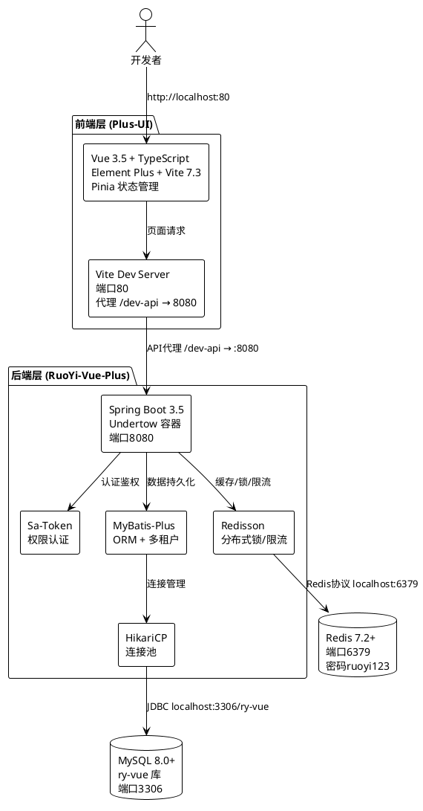

### 部署拓扑视图

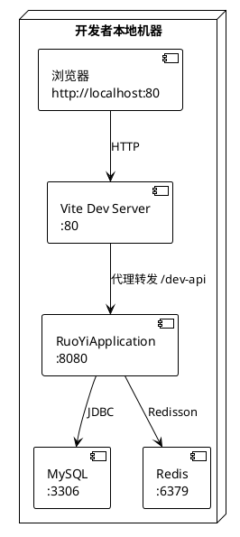

## **1.2 服务/组件总体架构**

### 后端模块架构

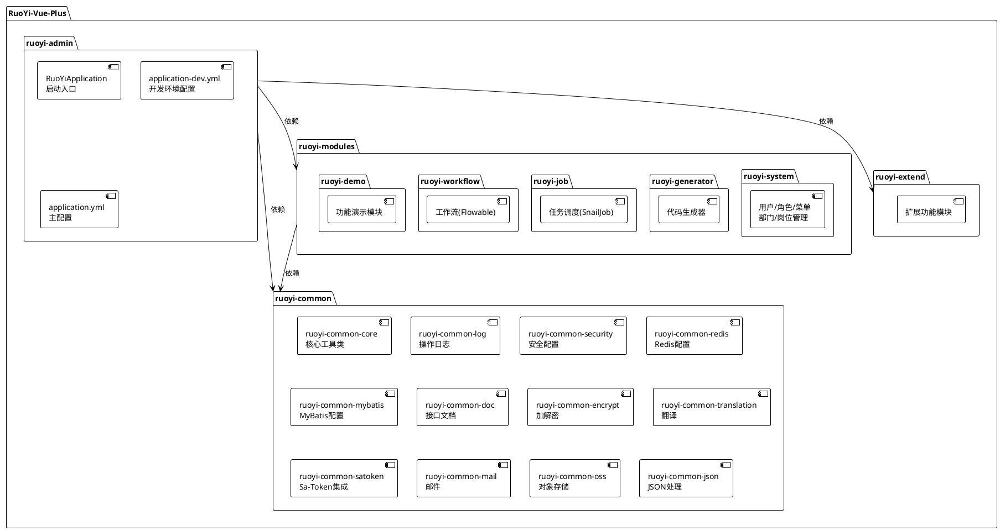

### 前端模块架构

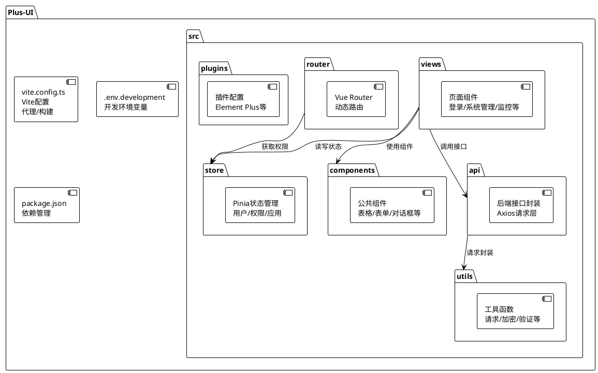

## **1.3 实现设计文档**

### 1.3.1 环境准备方案

#### 软件清单与版本约束

| 软件 | 最低版本 | 推荐版本 | 验证命令 | 用途 |
|------|---------|---------|---------|------|
| JDK | 17 | 17 或 21 | `java -version` | 后端编译运行 |
| Maven | 3.8 | 3.9.x | `mvn -version` | 后端构建 |
| Node.js | 20.19.0 | 20.x LTS | `node -v` | 前端运行时 |
| npm | 8.19.0 | 10.x | `npm -v` | 前端包管理 |
| MySQL | 8.0 | 8.0.x | `mysql --version` | 业务数据存储 |
| Redis | 6.0 | 7.2+ | `redis-cli ping` | 缓存/会话/锁 |
| Git | 任意稳定版 | 2.x | `git --version` | 代码版本控制 |

#### 环境安装步骤

**步骤1：JDK安装与配置**

```bash
# Windows: 下载并安装JDK 17或21
# 配置JAVA_HOME环境变量指向JDK安装目录
# 将%JAVA_HOME%\bin添加到PATH

# 验证
java -version
# 预期输出包含 "17" 或 "21"
```

**步骤2：Maven安装与配置**

```bash
# Windows: 下载Maven 3.9.x并解压
# 配置MAVEN_HOME环境变量
# 将%MAVEN_HOME%\bin添加到PATH

# 配置国内镜像源（settings.xml）
# 在 ~/.m2/settings.xml 中添加：
# <mirror>
#   <id>huaweicloud</id>
#   <url>https://mirrors.huaweicloud.com/repository/maven/</url>
#   <mirrorOf>*</mirrorOf>
# </mirror>

# 验证
mvn -version
```

**步骤3：Node.js安装**

```bash
# Windows: 下载Node.js 20.x LTS安装包
# npm随Node.js一同安装

# 配置npm国内镜像
npm config set registry https://registry.npmmirror.com

# 验证
node -v   # 预期 >= v20.19.0
npm -v    # 预期 >= 8.19.0
```

**步骤4：MySQL安装与启动**

```bash
# Windows: 下载MySQL 8.0安装包，安装后启动服务
# 默认账号: root/root

# 验证
mysql --version
mysql -u root -p -e "SELECT VERSION();"
```

**步骤5：Redis安装与启动**

```bash
# Windows: 下载Redis for Windows或使用WSL
# 修改redis.conf设置密码：
# requirepass ruoyi123

# 启动Redis服务
redis-server redis.conf

# 验证
redis-cli -a ruoyi123 ping
# 预期返回 PONG
```

**步骤6：Git安装**

```bash
# Windows: 下载Git for Windows安装
git --version
```

#### 环境检查脚本逻辑

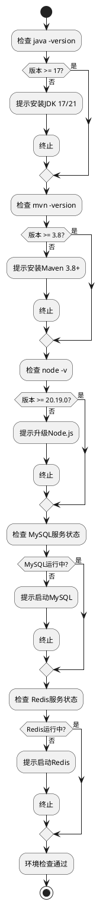

### 1.3.2 后端项目搭建方案

#### 代码克隆

```bash
# 克隆后端项目
git clone https://gitee.com/dromara/RuoYi-Vue-Plus.git
cd RuoYi-Vue-Plus
```

#### 关键配置文件修改

**application-dev.yml 数据源配置**

```yaml
# 文件路径: ruoyi-admin/src/main/resources/application-dev.yml
spring:
  datasource:
    dynamic:
      datasource:
        master:
          url: jdbc:mysql://localhost:3306/ry-vue?useUnicode=true&characterEncoding=utf8mb4&zeroDateTimeBehavior=convertToNull&useSSL=true&serverTimezone=GMT%2B8&autoReconnect=true&rewriteBatchedStatements=true
          username: root
          password: root  # 修改为本地MySQL密码
```

**application-dev.yml Redis配置**

```yaml
# 文件路径: ruoyi-admin/src/main/resources/application-dev.yml
spring:
  data:
    redis:
      host: localhost
      port: 6379
      password: ruoyi123  # 与Redis服务密码保持一致
      database: 0
```

#### Maven编译

```bash
# 在项目根目录执行
mvn clean install -DskipTests
# 预期输出: BUILD SUCCESS
```

#### 后端启动

```bash
# 方式1: Maven命令启动
mvn spring-boot:run -pl ruoyi-admin

# 方式2: IDE中运行 RuoYiApplication 主类
# 主类路径: ruoyi-admin/src/main/java/org/dromara/RuoYiApplication.java
```

#### 后端启动验证

```bash
# 健康检查
curl http://localhost:8080/actuator/health
# 预期: {"status":"UP"}

# 接口文档
# 浏览器访问: http://localhost:8080/doc.html

# 启动日志检查
# 预期包含: "Application RuoYi-Vue-Plus is running!"
```

### 1.3.3 前端项目搭建方案

#### 代码克隆

```bash
# 克隆前端项目（默认ts分支）
git clone https://gitee.com/JavaLionLi/plus-ui.git
cd plus-ui
```

#### 依赖安装

```bash
# 使用国内镜像安装依赖
npm install --registry=https://registry.npmmirror.com
# 预期: node_modules目录生成，无严重错误
```

#### 关键配置文件验证

**vite.config.ts 代理配置**

```typescript
// 文件路径: vite.config.ts
// 确认server.proxy配置如下：
server: {
  port: 80,  // 前端开发服务端口
  host: true,
  open: true,
  proxy: {
    '/dev-api': {
      target: 'http://localhost:8080',  // 后端服务地址
      changeOrigin: true,
      rewrite: (p) => p.replace(/^\/dev-api/, '')
    }
  }
}
```

**.env.development 环境变量**

```bash
# 文件路径: .env.development
VITE_APP_BASE_API = '/dev-api'
VITE_APP_PORT = 80
VITE_APP_ENCRYPT = true
VITE_APP_CLIENT_ID = e5cd7e4891bf95d1d19206ce24a7b32e
```

#### 前端启动

```bash
# 启动Vite开发服务
npm run dev
# 预期: 浏览器自动打开 http://localhost:80
```

#### 前端启动验证

```bash
# 页面访问验证
# 浏览器访问 http://localhost:80
# 预期: 显示RuoYi-Vue-Plus多租户管理系统登录页面

# API代理验证
# 在浏览器DevTools Network面板观察
# 登录操作的请求路径应为 /dev-api/auth/login
# 代理转发至 http://localhost:8080/auth/login
```

### 1.3.4 数据库初始化方案

#### 初始化流程

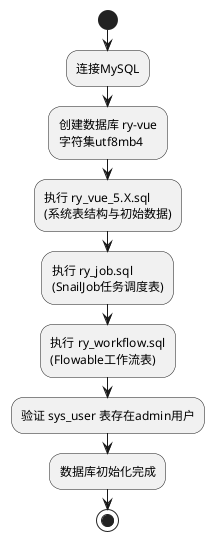

#### 具体步骤

```bash
# 步骤1: 创建数据库
mysql -u root -p -e "CREATE DATABASE IF NOT EXISTS \`ry-vue\` CHARACTER SET utf8mb4 COLLATE utf8mb4_general_ci;"

# 步骤2: 执行主库SQL（在RuoYi-Vue-Plus项目目录下）
mysql -u root -p ry-vue < script/sql/ry_vue_5.X.sql

# 步骤3: 执行任务调度SQL
mysql -u root -p ry-vue < script/sql/ry_job.sql

# 步骤4: 执行工作流SQL
mysql -u root -p ry-vue < script/sql/ry_workflow.sql

# 步骤5: 验证初始化结果
mysql -u root -p ry-vue -e "SHOW TABLES;"
mysql -u root -p ry-vue -e "SELECT user_name FROM sys_user WHERE user_id = 1;"
# 预期: admin
```

#### SQL脚本执行顺序约束

| 顺序 | SQL脚本 | 说明 | 关键表 |
|------|---------|------|--------|
| 1 | ry_vue_5.X.sql | 系统核心表结构与数据 | sys_user, sys_role, sys_menu, sys_dept, sys_dict_type 等 |
| 2 | ry_job.sql | SnailJob任务调度表 | sj_group_config, sj_job 等 |
| 3 | ry_workflow.sql | Flowable工作流表 | flow_definition, flow_instance 等 |

### 1.3.5 Redis配置方案

#### 配置步骤

```bash
# 步骤1: 修改redis.conf配置文件
# 找到redis.conf文件，修改以下配置：
# requirepass ruoyi123
# port 6379

# 步骤2: 启动Redis服务（使用配置文件）
redis-server /path/to/redis.conf

# 步骤3: 验证Redis连接
redis-cli -a ruoyi123 ping
# 预期返回: PONG

# 步骤4: 验证密码认证
redis-cli ping
# 预期返回: (error) NOAUTH Authentication required
# （确认密码已生效）
```

#### Redis与后端配置一致性校验

| 配置项 | Redis服务端 (redis.conf) | 后端 (application-dev.yml) | 默认值 |
|--------|--------------------------|---------------------------|--------|
| host | bind 127.0.0.1 | spring.data.redis.host | localhost |
| port | port 6379 | spring.data.redis.port | 6379 |
| password | requirepass ruoyi123 | spring.data.redis.password | ruoyi123 |

### 1.3.6 联调验证方案

#### 联调验证流程

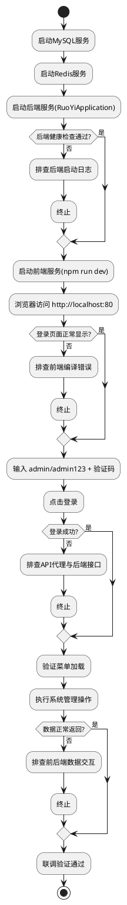

#### 验证检查清单

| 序号 | 验证项 | 操作方式 | 预期结果 |
|------|--------|---------|---------|
| 1 | 后端健康检查 | `curl http://localhost:8080/actuator/health` | `{"status":"UP"}` |
| 2 | 接口文档访问 | 浏览器访问 `http://localhost:8080/doc.html` | 显示Knife4j接口文档页面 |
| 3 | 前端页面加载 | 浏览器访问 `http://localhost:80` | 显示登录页面 |
| 4 | 验证码获取 | 登录页自动加载 | 显示数学计算验证码 |
| 5 | 管理员登录 | 输入admin/admin123+验证码 | 登录成功跳转首页 |
| 6 | 菜单加载 | 登录后观察左侧菜单 | 系统管理/系统监控等菜单正常 |
| 7 | 用户列表查询 | 系统管理→用户管理 | 用户列表数据正常显示 |
| 8 | API代理转发 | DevTools Network面板 | `/dev-api`请求代理至8080 |

### 1.3.7 二次开发就绪验证方案

#### 项目结构完整性验证

**后端项目结构**

```
RuoYi-Vue-Plus/
├── ruoyi-admin/          # 启动模块（RuoYiApplication）
├── ruoyi-common/         # 公共模块
│   ├── ruoyi-common-core/
│   ├── ruoyi-common-log/
│   ├── ruoyi-common-security/
│   ├── ruoyi-common-redis/
│   ├── ruoyi-common-mybatis/
│   ├── ruoyi-common-doc/
│   ├── ruoyi-common-encrypt/
│   ├── ruoyi-common-satoken/
│   └── ...
├── ruoyi-modules/        # 业务模块
│   ├── ruoyi-system/     # 系统管理
│   ├── ruoyi-generator/  # 代码生成
│   ├── ruoyi-job/        # 任务调度
│   ├── ruoyi-workflow/   # 工作流
│   └── ruoyi-demo/       # 演示模块
├── ruoyi-extend/         # 扩展模块
├── script/               # 脚本文件
│   └── sql/              # SQL初始化脚本
└── pom.xml               # Maven父POM
```

**前端项目结构**

```
plus-ui/
├── src/
│   ├── api/              # 后端接口封装
│   ├── views/            # 页面组件
│   ├── components/       # 公共组件
│   ├── store/            # Pinia状态管理
│   ├── router/           # 路由配置
│   ├── utils/            # 工具函数
│   ├── plugins/          # 插件配置
│   └── ...
├── public/               # 静态资源
├── vite.config.ts        # Vite配置
├── .env.development      # 开发环境变量
├── package.json          # 依赖管理
└── tsconfig.json         # TypeScript配置
```

#### 二次开发就绪验证步骤

```bash
# 1. 后端编译验证
cd RuoYi-Vue-Plus
mvn compile
# 预期: BUILD SUCCESS

# 2. 前端构建验证
cd plus-ui
npm run build:prod
# 预期: dist目录生成，构建成功

# 3. 代码生成器验证
# 登录系统 → 系统工具 → 代码生成
# 导入数据库表 → 生成代码 → 预览/下载

# 4. 业务功能验证
# 登录后执行以下操作：
# - 系统管理→用户管理：查看/新增/编辑用户
# - 系统管理→角色管理：查看/新增/编辑角色
# - 系统管理→菜单管理：查看菜单树
# - 系统监控→在线用户：查看在线用户列表
```

### 1.3.8 异常处理与回退方案

#### 异常场景与处理策略

| 异常场景 | 触发条件 | 诊断方式 | 处理策略 | 回退方案 |
|---------|---------|---------|---------|---------|
| JDK版本不满足 | java -version < 17 | 检查版本输出 | 安装JDK 17/21，配置JAVA_HOME | 卸载旧版本JDK后重新安装 |
| Maven依赖下载失败 | 网络不可达 | 查看mvn输出错误日志 | 配置华为云Maven镜像源 | 删除~/.m2/repository后重试 |
| MySQL服务未运行 | 连接拒绝 | `mysql -u root -p` 测试连接 | 启动MySQL服务 | 重装MySQL |
| MySQL密码不匹配 | 认证失败 | 后端日志Access denied | 修改application-dev.yml密码 | 重置MySQL root密码 |
| Redis服务未运行 | 连接拒绝 | `redis-cli ping` 无响应 | 启动Redis服务 | 重装Redis |
| Redis密码不匹配 | NOAUTH错误 | 后端日志Redis连接失败 | 统一redis.conf与yml密码 | 重启Redis并修改配置 |
| 数据库ry-vue已存在 | SQL执行冲突 | `SHOW DATABASES LIKE 'ry-vue'` | 备份后DROP重建 | 从备份恢复 |
| SQL脚本执行失败 | 语法/字符集不兼容 | MySQL错误日志 | 确认utf8mb4字符集和MySQL 8.0+ | 删除数据库重新初始化 |
| 后端启动-端口占用 | 8080已被占用 | `netstat -ano \| findstr 8080` | 终止占用进程或修改server.port | 修改配置使用其他端口 |
| 后端启动-依赖缺失 | ClassNotFoundException | 后端启动日志 | 重新执行`mvn clean install` | 删除本地Maven仓库缓存后重试 |
| 前端依赖安装失败 | 网络超时 | npm ERR!日志 | 切换npm镜像源 | `npm cache clean --force`后重试 |
| 前端启动-端口占用 | 80端口已被占用 | Vite报错EADDRINUSE | 修改.env.development中端口 | 终止占用80端口的进程 |
| 前端API代理失败 | 后端未启动 | Network面板502/超时 | 先启动后端再启动前端 | 检查vite.config.ts代理配置 |
| 登录失败-验证码错误 | 验证码输入不匹配 | 后端返回验证码错误 | 重新获取验证码 | 刷新页面 |
| 登录失败-后端未启动 | 网络错误 | 前端控制台Network Error | 启动后端服务 | 检查后端健康状态 |

#### 回退优先级

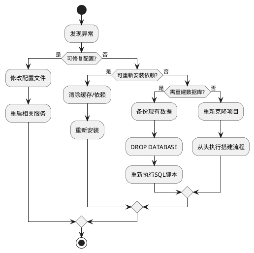

# **2. 接口设计**

## **2.1 总体设计**

### 前后端交互架构

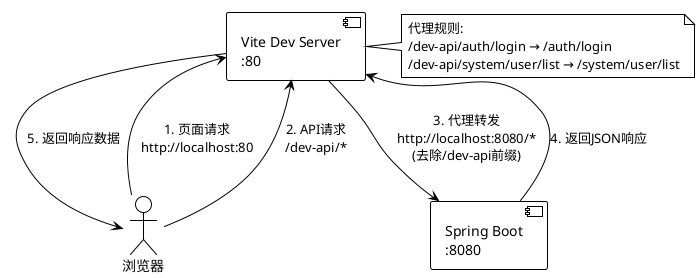

### 请求/响应规范

- **请求格式**：JSON（Content-Type: application/json）
- **响应格式**：统一包装 `{ code, msg, data }`
- **认证方式**：Sa-Token，Header携带 `Authorization: token值`
- **接口加密**：RSA+AES动态加密（VITE_APP_ENCRYPT=true时启用）
- **多租户**：Header携带 `tenant-id: 租户ID`（默认000000）

## **2.2 接口清单**

### 核心接口列表

| 接口路径 | 方法 | 说明 | 认证 | 请求参数 | 响应数据 |
|---------|------|------|------|---------|---------|
| /auth/login | POST | 用户登录 | 否 | { username, password, code, uuid } | { token, userInfo } |
| /auth/logout | POST | 用户登出 | 是 | - | void |
| /auth/register | POST | 用户注册 | 否 | { username, password } | void |
| /system/user/list | GET | 用户列表 | 是 | { pageNum, pageSize, ... } | { rows, total } |
| /system/role/list | GET | 角色列表 | 是 | { pageNum, pageSize, ... } | { rows, total } |
| /system/menu/list | GET | 菜单列表 | 是 | - | menuTree |
| /system/dept/list | GET | 部门列表 | 是 | - | deptTree |
| /system/dict/type/list | GET | 字典类型列表 | 是 | { pageNum, pageSize } | { rows, total } |
| /system/post/list | GET | 岗位列表 | 是 | { pageNum, pageSize } | { rows, total } |
| /monitor/online/list | GET | 在线用户列表 | 是 | { pageNum, pageSize } | { rows, total } |
| /tool/gen/list | GET | 代码生成表列表 | 是 | { pageNum, pageSize } | { rows, total } |
| /tool/gen/import | POST | 导入表结构 | 是 | { tables } | void |
| /actuator/health | GET | 健康检查 | 否 | - | { status } |
| /captchaImage | GET | 获取验证码 | 否 | - | { img, uuid, enabled } |
| /getInfo | GET | 获取当前用户信息 | 是 | - | { user, roles, permissions } |
| /getRouters | GET | 获取动态路由 | 是 | - | routeTree |

### 登录认证时序

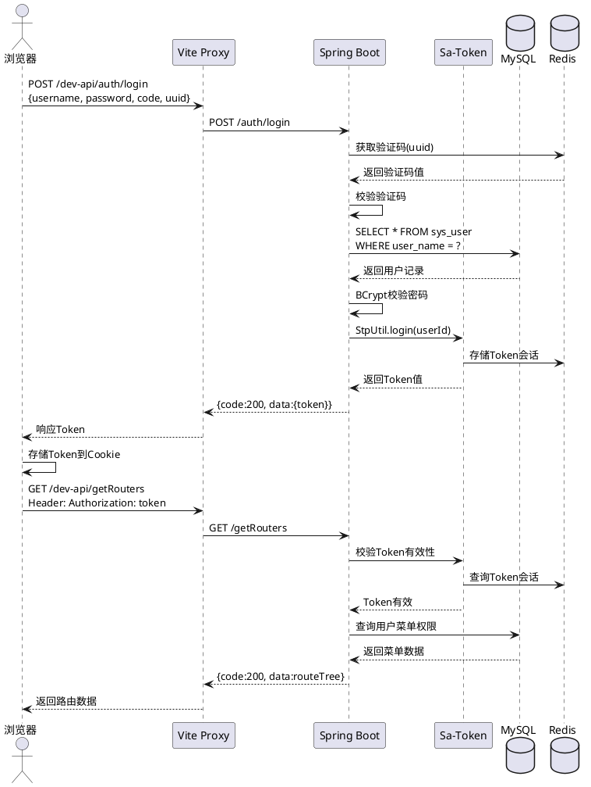

# **4. 数据模型**

## **4.1 设计目标**

1. 支持RuoYi-Vue-Plus系统全部核心业务表
2. 支持多租户数据隔离（tenant_id字段）
3. 支持逻辑删除（del_flag字段）
4. 支持审计字段（create_by, create_time, update_by, update_time）
5. 字符集统一为utf8mb4，支持中文和Emoji

## **4.2 模型实现**

### 核心数据表ER关系

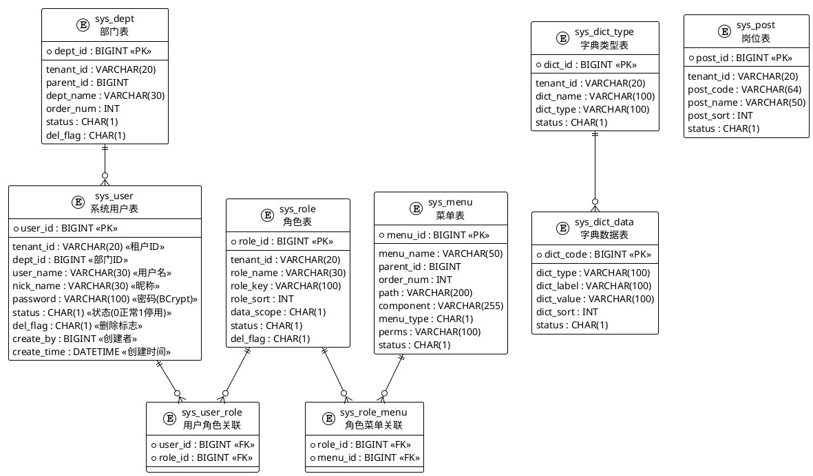

### 数据库初始化数据模型

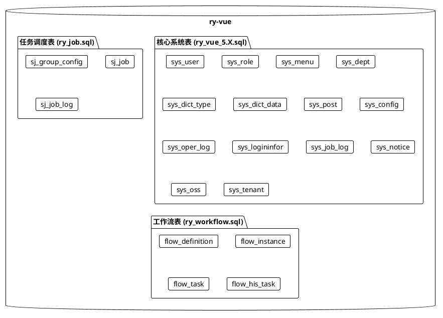

### 关键配置数据模型

**后端配置模型 (application-dev.yml)**

```yaml
# 服务器配置
server:
  port: 8080                    # 服务端口

# 数据源配置
spring:
  datasource:
    dynamic:
      datasource:
        master:
          url: jdbc:mysql://localhost:3306/ry-vue?...  # 数据库URL
          username: root                                    # 数据库用户名
          password: root                                    # 数据库密码

# Redis配置
spring:
  data:
    redis:
      host: localhost            # Redis地址
      port: 6379                 # Redis端口
      password: ruoyi123         # Redis密码
      database: 0                # Redis数据库索引

# Sa-Token配置
sa-token:
  token-name: Authorization      # Token名称
  timeout: 86400                 # Token有效期(秒)

# 多租户配置
tenant:
  enable: true                   # 多租户开关
```

**前端配置模型 (.env.development)**

```bash
VITE_APP_BASE_API = '/dev-api'                              # API基础路径
VITE_APP_PORT = 80                                          # 前端服务端口
VITE_APP_ENCRYPT = true                                     # 接口加密开关
VITE_APP_CLIENT_ID = e5cd7e4891bf95d1d19206ce24a7b32e       # 客户端ID
VITE_APP_WEBSOCKET = false                                  # WebSocket开关
VITE_APP_SSE = true                                         # SSE推送开关
```