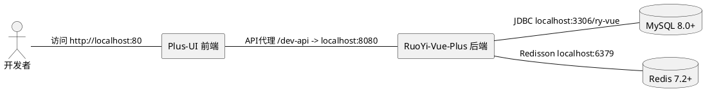
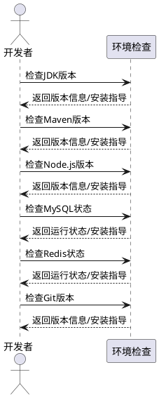
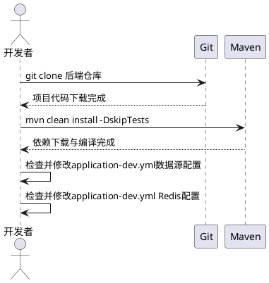
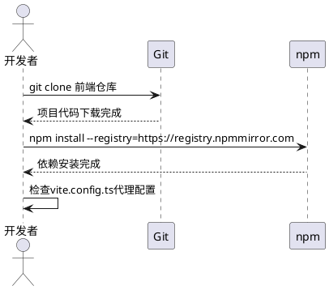
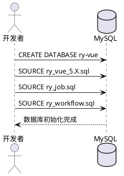
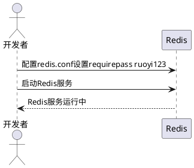
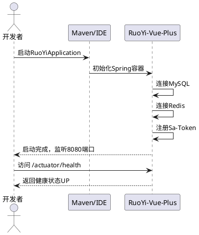
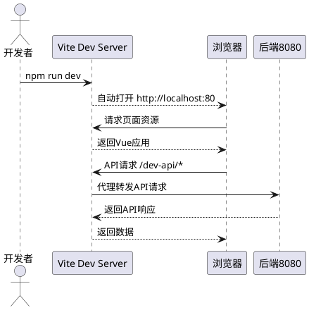
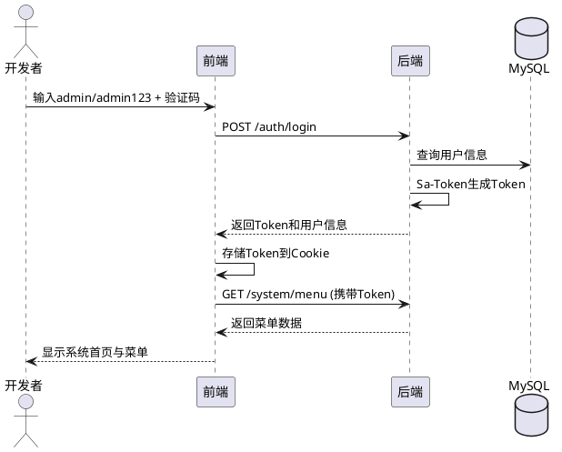
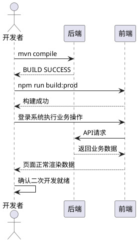

# **1. 组件定位**

## **1.1 核心职责**

本组件负责将 RuoYi-Vue-Plus 前后端开源项目完整部署并启动，实现可二次开发的就绪状态。

## **1.2 核心输入**

1. 前端项目仓库：`https://gitee.com/JavaLionLi/plus-ui.git`（Vue3 + TypeScript + Element Plus + Vite）
2. 后端项目仓库：`https://gitee.com/dromara/RuoYi-Vue-Plus.git`（Spring Boot 3.5 + MyBatis-Plus + Sa-Token）
3. 数据库初始化脚本：`script/sql/ry_vue_5.X.sql`、`ry_job.sql`、`ry_workflow.sql`
4. 用户本地环境信息：操作系统、已安装软件及版本

## **1.3 核心输出**

1. 完整运行的后端服务（端口8080）
2. 完整运行的前端开发服务（端口80）
3. 已初始化的MySQL数据库（数据库名`ry-vue`）
4. 已运行的Redis服务（端口6379，密码`ruoyi123`）
5. 二次开发就绪的项目工作区

## **1.4 职责边界**

1. 不负责生产环境部署与Docker编排
2. 不负责MinIO/SnailJob/SpringBoot-Admin等可选组件的部署
3. 不负责项目业务功能的二次开发具体实现
4. 不负责云服务器购买与域名配置
5. 不负责IDE（IDEA/VSCode）的安装与配置

# **2. 领域术语**

**RuoYi-Vue-Plus**
: 基于Spring Boot 3.5的Java后端分布式集群多租户管理系统框架，版本5.6.1。
: 备注：后端项目，仓库地址 https://gitee.com/dromara/RuoYi-Vue-Plus.git

**Plus-UI**
: 基于Vue3 + TypeScript + Element Plus + Vite的前端管理界面项目，版本5.6.1-2.6.1。
: 备注：前端项目，仓库地址 https://gitee.com/JavaLionLi/plus-ui.git

**Sa-Token**
: 轻轻级Java权限认证框架，用于替代Spring Security，支持JWT、多端登录等。

**MyBatis-Plus**
: MyBatis增强工具，提供CRUD操作、分页插件、多租户插件等。

**Redisson**
: 基于Netty的Redis Java客户端，支持分布式锁、分布式限流等高级特性。

**Undertow**
: 基于XNIO的高性能Java Web容器，替代Tomcat。

**SnailJob**
: 分布式任务调度框架，可选组件。

**MinIO**
: 分布式对象存储服务，可选组件。

**HikariCP**
: 高性能JDBC数据库连接池，Spring Boot默认内置。

**ry-vue**
: MySQL数据库名称，后端默认连接的数据库名。

# **3. 角色与边界**

## **3.1 核心角色**

**开发者**：负责按照指导步骤执行环境安装、项目克隆、配置修改和服务启动操作。

## **3.2 外部系统**

**MySQL 8.0+**：关系型数据库，存储业务数据，默认端口3306，默认账号root/root，默认数据库ry-vue。

**Redis 7.2+**：缓存数据库，存储会话、缓存、分布式锁数据，默认端口6379，默认密码ruoyi123。

**Maven 3.8+**：Java项目构建工具，用于后端依赖下载与编译打包。

**Node.js 20.19+**：JavaScript运行时，用于前端依赖安装与开发服务启动。

**npm 8.19+**：Node包管理器，用于前端依赖管理。

**JDK 17/21**：Java开发工具包，后端编译与运行的基础环境。

**Git**：版本控制工具，用于项目代码克隆。

## **3.3 交互上下文**

# **4. DFX约束**

## **4.1 性能**

1. 后端启动时间应在120秒内完成
2. 前端开发服务启动时间应在60秒内完成
3. 前端页面首屏加载时间应在3秒内

## **4.2 可靠性**

1. 后端服务启动后应保持稳定运行，无内存溢出或启动失败
2. 前端开发服务应支持热更新，代码修改后自动刷新
3. 数据库连接池应正常初始化，默认最大连接数20

## **4.3 安全性**

1. Redis必须设置密码（默认ruoyi123），禁止无密码运行
2. 数据库账号密码不应使用生产环境凭证
3. 接口传输加密默认开启（RSA+AES动态加密）

## **4.4 可维护性**

1. 后端日志输出到 `./logs/` 目录
2. 前端开发环境通过Vite代理转发API请求，无需额外Nginx配置
3. 项目结构应保持与原仓库一致，便于后续合并更新

## **4.5 兼容性**

1. JDK版本支持17和21
2. Node.js版本要求 >= 20.19.0
3. MySQL版本要求 >= 8.0
4. Redis版本要求 >= 6（推荐7.2+）
5. 操作系统支持Windows、macOS、Linux

# **5. 核心能力**

## **5.1 环境准备**

### **5.1.1 业务规则**

1. **JDK安装验证**：系统必须安装JDK 17或JDK 21，并配置JAVA_HOME环境变量

   a. 验收条件：[执行 `java -version`] → [输出包含 "17" 或 "21" 版本号]

2. **Maven安装验证**：系统必须安装Maven 3.8+，并配置MAVEN_HOME环境变量

   a. 验收条件：[执行 `mvn -version`] → [输出Maven版本号 >= 3.8]

3. **Node.js安装验证**：系统必须安装Node.js >= 20.19.0

   a. 验收条件：[执行 `node -v`] → [输出版本号 >= v20.19.0]

4. **npm安装验证**：系统必须安装npm >= 8.19.0

   a. 验收条件：[执行 `npm -v`] → [输出版本号 >= 8.19.0]

5. **MySQL安装验证**：系统必须安装MySQL >= 8.0，服务处于运行状态

   a. 验收条件：[执行 `mysql --version`] → [输出MySQL版本号 >= 8.0]

6. **Redis安装验证**：系统必须安装Redis >= 6.0，服务处于运行状态

   a. 验收条件：[执行 `redis-cli ping`] → [返回 PONG]

7. **Git安装验证**：系统必须安装Git

   a. 验收条件：[执行 `git --version`] → [输出Git版本号]

8. **禁止项**：禁止使用JDK 8或JDK 11，后端基于Spring Boot 3.5，不兼容

   a. 验收条件：[使用JDK 8启动后端] → [启动失败，报错UnsupportedClassVersionError]

### **5.1.2 交互流程**

### **5.1.3 异常场景**

1. **JDK版本不满足**

   a. 触发条件：已安装JDK但版本低于17
   b. 系统行为：提示用户卸载旧版本并安装JDK 17或21
   c. 用户感知：明确提示"当前JDK版本不满足要求，请安装JDK 17或JDK 21"

2. **Node.js版本不满足**

   a. 触发条件：已安装Node.js但版本低于20.19.0
   b. 系统行为：提示用户升级Node.js至20.19.0+
   c. 用户感知：明确提示"当前Node.js版本不满足要求，请升级至v20.19.0+"

3. **MySQL未运行**

   a. 触发条件：MySQL服务未启动
   b. 系统行为：提示用户启动MySQL服务
   c. 用户感知：明确提示"MySQL服务未运行，请先启动MySQL服务"

4. **Redis未运行**

   a. 触发条件：Redis服务未启动
   b. 系统行为：提示用户启动Redis服务
   c. 用户感知：明确提示"Redis服务未运行，请先启动Redis服务"

## **5.2 后端项目克隆与配置**

### **5.2.1 业务规则**

1. **后端代码克隆**：必须从Gitee仓库克隆后端项目至本地

   a. 验收条件：[执行 `git clone https://gitee.com/dromara/RuoYi-Vue-Plus.git`] → [项目目录包含pom.xml、ruoyi-admin、ruoyi-common等子模块]

2. **Maven依赖下载**：必须成功下载所有Maven依赖

   a. 验收条件：[在项目根目录执行 `mvn clean install -DskipTests`] → [输出BUILD SUCCESS]

3. **数据源配置验证**：必须确认`application-dev.yml`中数据源配置与本地MySQL一致

   a. 验收条件：[检查application-dev.yml中spring.datasource.dynamic.datasource.master配置] → [url指向localhost:3306/ry-vue，username为root，password与本地MySQL密码一致]

4. **Redis配置验证**：必须确认`application-dev.yml`中Redis配置与本地Redis一致

   a. 验收条件：[检查application-dev.yml中spring.data.redis配置] → [host为localhost，port为6379，password与本地Redis密码一致（默认ruoyi123）]

5. **Maven Profile选择**：开发环境应使用`dev` profile（默认激活）

   a. 验收条件：[检查pom.xml中profiles配置] → [dev profile的activeByDefault为true]

### **5.2.2 交互流程**

### **5.2.3 异常场景**

1. **Maven依赖下载失败**

   a. 触发条件：网络问题或Maven仓库不可达
   b. 系统行为：提示用户配置国内Maven镜像源（如华为云镜像 https://mirrors.huaweicloud.com/repository/maven/）
   c. 用户感知：提示"Maven依赖下载失败，请检查网络或配置国内Maven镜像源"

2. **数据源连接配置不匹配**

   a. 触发条件：application-dev.yml中数据库账号密码与本地MySQL不一致
   b. 系统行为：提示用户修改配置文件中的username和password
   c. 用户感知：提示"数据库连接配置与本地MySQL不一致，请修改application-dev.yml"

## **5.3 前端项目克隆与配置**

### **5.3.1 业务规则**

1. **前端代码克隆**：必须从Gitee仓库克隆前端项目至本地，使用ts分支（稳定发布主分支）

   a. 验收条件：[执行 `git clone https://gitee.com/JavaLionLi/plus-ui.git`] → [项目目录包含package.json、src、vite.config.ts等文件]

2. **前端依赖安装**：必须使用npm安装所有前端依赖，推荐使用国内镜像源

   a. 验收条件：[执行 `npm install --registry=https://registry.npmmirror.com`] → [node_modules目录生成，无严重错误]

3. **前端代理配置验证**：必须确认Vite代理配置正确指向后端8080端口

   a. 验收条件：[检查vite.config.ts中server.proxy配置] → [/dev-api代理目标为http://localhost:8080]

4. **前端环境变量验证**：必须确认.env.development中API路径配置正确

   a. 验收条件：[检查.env.development] → [VITE_APP_BASE_API为/dev-api，VITE_APP_PORT为80]

### **5.3.2 交互流程**

### **5.3.3 异常场景**

1. **npm依赖安装失败**

   a. 触发条件：网络问题或npm源不可达
   b. 系统行为：提示用户切换npm镜像源或清除缓存重试
   c. 用户感知：提示"npm依赖安装失败，请尝试切换镜像源或执行npm cache clean --force后重试"

2. **Node.js版本不兼容**

   a. 触发条件：Node.js版本低于20.19.0导致依赖安装报错
   b. 系统行为：提示用户升级Node.js
   c. 用户感知：提示"Node.js版本不兼容，请升级至v20.19.0+"

## **5.4 数据库初始化**

### **5.4.1 业务规则**

1. **数据库创建**：必须在MySQL中创建名为`ry-vue`的数据库，字符集为utf8mb4

   a. 验收条件：[执行 `CREATE DATABASE IF NOT EXISTS ry-vue CHARACTER SET utf8mb4 COLLATE utf8mb4_general_ci;`] → [数据库ry-vue创建成功]

2. **主库SQL执行**：必须按顺序执行`ry_vue_5.X.sql`初始化系统表结构与数据

   a. 验收条件：[在ry-vue数据库中执行ry_vue_5.X.sql] → [sys_user、sys_role、sys_menu等系统表创建成功并包含初始数据]

3. **任务调度SQL执行**：必须执行`ry_job.sql`初始化SnailJob相关表

   a. 验收条件：[在ry-vue数据库中执行ry_job.sql] → [sj_group_config等任务调度表创建成功]

4. **工作流SQL执行**：必须执行`ry_workflow.sql`初始化工作流相关表

   a. 验收条件：[在ry-vue数据库中执行ry_workflow.sql] → [flow_definition等工作流表创建成功]

5. **SQL执行顺序**：必须按 ry_vue_5.X.sql → ry_job.sql → ry_workflow.sql 顺序执行

   a. 验收条件：[乱序执行SQL] → [可能因外键依赖导致执行失败]

6. **默认管理员账号**：系统初始化后应包含默认管理员账号

   a. 验收条件：[查询sys_user表] → [存在admin用户，默认密码为admin123]

### **5.4.2 交互流程**

### **5.4.3 异常场景**

1. **SQL执行报错**

   a. 触发条件：SQL脚本中存在语法不兼容或表已存在
   b. 系统行为：提示用户检查MySQL版本是否 >= 8.0，确认数据库字符集为utf8mb4
   c. 用户感知：提示"SQL执行失败，请检查MySQL版本和字符集配置"

2. **数据库连接失败**

   a. 触发条件：MySQL账号密码错误或服务未启动
   b. 系统行为：提示用户确认MySQL服务状态和账号密码
   c. 用户感知：提示"无法连接MySQL，请确认服务已启动且账号密码正确"

3. **数据库已存在旧数据**

   a. 触发条件：ry-vue数据库已存在且包含旧版本数据
   b. 系统行为：提示用户备份数据后删除旧数据库重新初始化
   c. 用户感知：提示"数据库已存在旧数据，建议备份后删除重建"

## **5.5 Redis配置与启动**

### **5.5.1 业务规则**

1. **Redis密码配置**：Redis必须设置密码为`ruoyi123`，与后端配置保持一致

   a. 验收条件：[检查redis.conf中requirepass配置] → [requirepass为ruoyi123]

2. **Redis服务启动**：Redis服务必须处于运行状态

   a. 验收条件：[执行 `redis-cli -a ruoyi123 ping`] → [返回PONG]

3. **Redis端口验证**：Redis应监听默认端口6379

   a. 验收条件：[检查Redis配置] → [port为6379]

### **5.5.2 交互流程**

### **5.5.3 异常场景**

1. **Redis密码不匹配**

   a. 触发条件：Redis实际密码与application-dev.yml中配置不一致
   b. 系统行为：提示用户修改Redis密码或修改后端配置文件
   c. 用户感知：提示"Redis密码与后端配置不一致，请统一配置"

2. **Redis端口冲突**

   a. 触发条件：6379端口已被其他服务占用
   b. 系统行为：提示用户修改Redis端口并同步修改后端配置
   c. 用户感知：提示"Redis端口6379被占用，请修改端口或释放占用"

## **5.6 后端启动与验证**

### **5.6.1 业务规则**

1. **后端启动方式**：必须通过Maven命令或IDE启动ruoyi-admin模块的RuoYiApplication主类

   a. 验收条件：[执行 `mvn spring-boot:run -pl ruoyi-admin` 或在IDE中运行RuoYiApplication] → [后端服务启动，监听8080端口]

2. **后端健康检查**：后端启动完成后必须能正常响应健康检查接口

   a. 验收条件：[访问 http://localhost:8080/actuator/health] → [返回HTTP 200，status为UP]

3. **后端接口文档验证**：Swagger接口文档必须可正常访问

   a. 验收条件：[访问 http://localhost:8080/doc.html] → [显示接口文档页面]

4. **后端日志验证**：启动日志中应无ERROR级别异常

   a. 验收条件：[检查启动日志] → [无ERROR异常，显示"Application RuoYi-Vue-Plus is running!"]

5. **后端端口验证**：后端服务必须监听8080端口

   a. 验收条件：[访问 http://localhost:8080] → [返回HTTP响应]

### **5.6.2 交互流程**

### **5.6.3 异常场景**

1. **后端启动失败-数据库连接异常**

   a. 触发条件：MySQL未启动或账号密码错误
   b. 系统行为：后端启动报错，日志显示数据库连接失败
   c. 用户感知：提示"后端启动失败：数据库连接异常，请检查MySQL服务状态和配置"

2. **后端启动失败-Redis连接异常**

   a. 触发条件：Redis未启动或密码不匹配
   b. 系统行为：后端启动报错，日志显示Redis连接失败
   c. 用户感知：提示"后端启动失败：Redis连接异常，请检查Redis服务状态和密码配置"

3. **后端启动失败-端口占用**

   a. 触发条件：8080端口已被其他服务占用
   b. 系统行为：后端启动报错，日志显示端口绑定失败
   c. 用户感知：提示"后端启动失败：8080端口被占用，请释放端口或修改server.port配置"

4. **后端启动失败-依赖缺失**

   a. 触发条件：Maven依赖未完整下载
   b. 系统行为：编译报错，ClassNotFoundException
   c. 用户感知：提示"后端启动失败：依赖缺失，请重新执行mvn clean install"

## **5.7 前端启动与验证**

### **5.7.1 业务规则**

1. **前端启动方式**：必须通过npm run dev命令启动Vite开发服务

   a. 验收条件：[执行 `npm run dev`] → [Vite开发服务启动，监听80端口，浏览器自动打开]

2. **前端页面访问验证**：启动后必须能正常访问登录页面

   a. 验收条件：[访问 http://localhost:80] → [显示RuoYi-Vue-Plus多租户管理系统登录页面]

3. **前端API代理验证**：前端必须能通过Vite代理正常转发API请求至后端

   a. 验收条件：[在前端页面触发登录操作] → [Network面板显示/dev-api请求被代理至localhost:8080]

4. **前端编译无错误**：Vite启动后控制台应无编译错误

   a. 验收条件：[检查Vite控制台输出] → [无红色ERROR信息]

### **5.7.2 交互流程**

### **5.7.3 异常场景**

1. **前端启动失败-依赖未安装**

   a. 触发条件：未执行npm install即运行npm run dev
   b. 系统行为：Vite启动报错，找不到模块
   c. 用户感知：提示"前端启动失败：请先执行npm install安装依赖"

2. **前端启动失败-端口占用**

   a. 触发条件：80端口已被其他服务占用
   b. 系统行为：Vite启动报错，端口绑定失败
   c. 用户感知：提示"前端启动失败：80端口被占用，请修改.env.development中VITE_APP_PORT或释放端口"

3. **前端API代理失败**

   a. 触发条件：后端未启动，前端代理无法连接8080端口
   b. 系统行为：API请求返回502或连接超时
   c. 用户感知：提示"API请求失败，请确认后端服务已启动在8080端口"

## **5.8 系统登录验证**

### **5.8.1 业务规则**

1. **管理员登录验证**：必须能使用默认管理员账号登录系统

   a. 验收条件：[输入用户名admin、密码admin123，点击登录] → [成功登录并跳转至系统首页]

2. **验证码验证**：登录页面必须显示验证码（默认数学计算型）

   a. 验收条件：[打开登录页面] → [显示数学计算验证码]

3. **登录后菜单加载**：登录成功后必须正常加载系统菜单

   a. 验收条件：[登录成功后] → [左侧菜单栏正常显示系统管理、系统监控等菜单项]

### **5.8.2 交互流程**

### **5.8.3 异常场景**

1. **登录失败-密码错误**

   a. 触发条件：输入的密码与数据库中存储的密码不匹配
   b. 系统行为：后端返回认证失败错误
   c. 用户感知：提示"用户名或密码错误"

2. **登录失败-验证码错误**

   a. 触发条件：输入的验证码与生成的不匹配
   b. 系统行为：后端返回验证码错误
   c. 用户感知：提示"验证码错误"

3. **登录失败-后端未启动**

   a. 触发条件：后端服务未运行
   b. 系统行为：前端API请求超时或网络错误
   c. 用户感知：提示"网络错误，请检查后端服务是否已启动"

## **5.9 二次开发就绪验证**

### **5.9.1 业务规则**

1. **后端项目结构完整性**：后端项目必须包含所有核心模块

   a. 验收条件：[检查项目目录] → [包含ruoyi-admin、ruoyi-common、ruoyi-modules（ruoyi-system、ruoyi-generator、ruoyi-job、ruoyi-demo、ruoyi-workflow）、ruoyi-extend模块]

2. **前端项目结构完整性**：前端项目必须包含所有核心目录

   a. 验收条件：[检查项目目录] → [包含src（api、views、components、store、router等子目录）、public、vite.config.ts]

3. **后端代码可编译**：后端代码必须能通过Maven编译无错误

   a. 验收条件：[执行 `mvn compile`] → [输出BUILD SUCCESS]

4. **前端代码可编译**：前端代码必须能通过TypeScript编译无错误

   a. 验收条件：[执行 `npm run build:prod`] → [构建成功，生成dist目录]

5. **前后端联调验证**：前后端必须能正常进行数据交互

   a. 验收条件：[在前端执行登录、查询用户列表等操作] → [数据正常返回并渲染]

6. **代码生成器可用**：后端代码生成器功能必须可用

   a. 验收条件：[在系统中访问代码生成功能] → [能正常导入表并生成代码]

### **5.9.2 交互流程**

### **5.9.3 异常场景**

1. **后端编译失败**

   a. 触发条件：代码被修改导致编译错误
   b. 系统行为：Maven编译报错
   c. 用户感知：提示"后端编译失败，请检查代码修改或重新拉取代码"

2. **前端构建失败**

   a. 触发条件：TypeScript类型错误或依赖缺失
   b. 系统行为：Vite构建报错
   c. 用户感知：提示"前端构建失败，请检查TypeScript类型或重新安装依赖"

3. **前后端联调异常**

   a. 触发条件：前端API请求返回非预期数据
   b. 系统行为：前端页面显示错误或数据为空
   c. 用户感知：提示"前后端联调异常，请检查API路径和后端接口是否正常"

# **6. 数据约束**

## **6.1 后端配置数据**

1. **server.port**：后端服务端口，默认值8080
2. **spring.datasource.url**：数据库连接地址，默认值jdbc:mysql://localhost:3306/ry-vue
3. **spring.datasource.username**：数据库用户名，默认值root
4. **spring.datasource.password**：数据库密码，默认值root
5. **spring.data.redis.host**：Redis地址，默认值localhost
6. **spring.data.redis.port**：Redis端口，默认值6379
7. **spring.data.redis.password**：Redis密码，默认值ruoyi123
8. **sa-token.token-name**：Token名称，默认值Authorization
9. **tenant.enable**：多租户开关，默认值true

## **6.2 前端配置数据**

1. **VITE_APP_BASE_API**：API基础路径，开发环境默认值/dev-api
2. **VITE_APP_PORT**：前端服务端口，默认值80
3. **VITE_APP_ENCRYPT**：接口加密开关，默认值true
4. **VITE_APP_CLIENT_ID**：客户端ID，默认值e5cd7e4891bf95d1d19206ce24a7b32e
5. **VITE_APP_WEBSOCKET**：WebSocket开关，默认值false
6. **VITE_APP_SSE**：SSE推送开关，默认值true

## **6.3 数据库初始化数据**

1. **数据库名**：ry-vue，必须使用utf8mb4字符集
2. **SQL脚本**：ry_vue_5.X.sql（主库）、ry_job.sql（任务调度）、ry_workflow.sql（工作流）
3. **默认管理员**：用户名admin，密码admin123
4. **默认租户**：租户ID 000000

## **6.4 环境版本约束**

1. **JDK版本**：必须为17或21，禁止使用8或11
2. **Node.js版本**：必须 >= 20.19.0
3. **npm版本**：必须 >= 8.19.0
4. **Maven版本**：必须 >= 3.8
5. **MySQL版本**：必须 >= 8.0
6. **Redis版本**：必须 >= 6.0，推荐 >= 7.2
7. **Git版本**：任意稳定版本即可